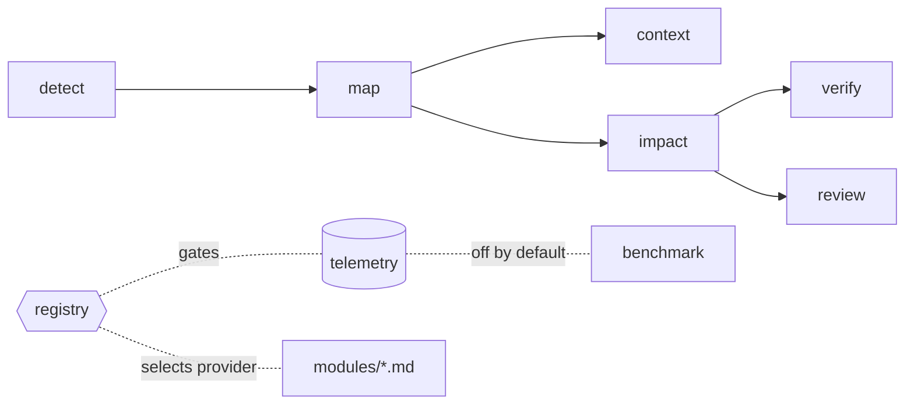

# Yindee

**Token-efficient development harness for AI coding agents.**
_Give AI less context, but better context._

Yindee is not a big prompt. It is a small, zero-dependency Node CLI that answers — deterministically —
the questions an agent would otherwise burn context rediscovering: what is this repo, which files does
this task need, what did I break, what should I run, what should I review.

```
Without Yindee                          With Yindee
──────────────────────────────          ──────────────────────────────
glob **/* to find your bearings         yindee map        (cached, ~15 lines)
read 20 files hoping 3 matter           yindee context    names the files
guess which tests are relevant          yindee impact     computes them
run everything, or nothing              yindee verify     runs the risk-tiered plan
re-read the repo to review a diff       yindee review     bounded diff + checklist
"this took about 20 minutes"            yindee benchmark  measured, or "unavailable"
```

Every one of those is a script, not a judgement call. The model spends its context on the actual
problem.

---

## The problem

An AI coding agent is expensive in exactly the places it adds no value:

- **Rediscovery.** Every session re-learns the same repository layout, package graph and commands.
- **Over-fetching.** "Read the files you need" becomes "read everything that might matter."
- **Unfocused verification.** Either the whole suite runs for a one-line change, or nothing does.
- **Review by re-reading.** Reviewing a 3-file change should not cost a repository scan.
- **Invented numbers.** Asked how long a task took or what it cost, a model will estimate. It cannot
  read a clock and it cannot see its own token usage.

None of these need a language model. All of them need a script.

## Deterministic-first

> If git, the build system, the test runner, CI, or a filesystem walk can answer it,
> **it must not cost model reasoning.**

Yindee draws the line there and stays on its side of it. Detection reads manifests, lockfiles,
workspace globs and the git index — no network, no model, no heuristics that drift between runs. The
same repository state always produces the same map, the same tier and the same plan.

What is left over — design, trade-offs, actually writing the code — is what the model is for.

## Architecture

Three layers. Each knows only the one below it.

```
Core        deterministic engine — detect · map · context · impact · verify · review
   ↓          resolveModules(root, flags)
Modules     named behaviors, each an on/off switch, resolved from config
   ↓          ordered chain, first present wins
Providers   who fulfils a module: an installed skill, a builtin doc, or core itself
```

**Core** is the part that must never guess. It answers repository questions from manifests,
git and the build system, and it has no knowledge of which modules exist — it asks the
registry and acts on the answer.

**Modules** are the switches. Each has a default, optional `requires`, and an optional doc
under `modules/` that the agent reads only when the module is on.

**Providers** are who actually does it. Every chain ends in a provider that is always present
(`builtin` or `core`), so a missing external skill degrades output by a notch — it can never
break a command, and Yindee never installs anything to satisfy one.



```
scripts/
  yindee.mjs          CLI: one command per question
  lib/
    detect.mjs        stacks, package manager, workspace layout, commands, CI   (deterministic)
    map.mjs           builds + caches the project map behind a fingerprint
    init.mjs          project initialization + the fingerprint that keeps it cheap
    areas.mjs         path -> area (frontend/backend/database/security/infra/test) + sensitivity
    context.mjs       task -> packages, rules, files to open
    candidates.mjs    ranks files for a task; shared with reference repositories
    budget.mjs        how much source a lookup may return; ranks and splits the rest
    explore.mjs       exploration policy + broad-task decomposition
    reference.mjs     a second repository, mapped and compared without loading it
    impact.mjs        changed files -> packages -> dependents -> risk tier -> verify plan
    verify.mjs        runs the plan, reports failing evidence only
    review.mjs        bounded diff + path-scoped checklist + failure evidence
    gitx.mjs          git/GitHub state; degrades gracefully at every step
    telemetry.mjs     measured session counters, persisted run history
    tokens.mjs        actual Claude token usage, or an honest "unavailable"
    benchmark.mjs     report + comparison rendering
    registry.mjs      modules + providers: what is on, and who provides it
    sh.mjs fsx.mjs util.mjs toml.mjs
rules/                frontend, backend, database, security — loaded only when named
modules/              one file per optional behavior — loaded only when the module is on
references/           git-native team workflow
templates/            lean CLAUDE.md router for `install`
```

The map is cached in `.claude/yindee/` behind a fingerprint of the repo's manifest files (and the
workspace directories that hold them, so a newly added package invalidates it) plus a fingerprint of
the harness itself. It rebuilds when the project changes or when Yindee is upgraded — and at no
other time. `init` records that fingerprint, which is why every command can initialize the project
implicitly and a second run costs one stat sweep:

```
$ yindee init
Project already initialized.
Map cache valid.
No rebuild required.
```

## Features

| Command | Answers |
| --- | --- |
| `init` | What is this project — stack, packages, commands, CI, git. Runs itself on first use. |
| `map` | What is this repo — packages, dependency graph, commands, CI. Cached. |
| `context "<task>"` | Which packages, rules and files does *this task* need — and how much of them. |
| `impact` | What changed, what depends on it, how risky, what to run. |
| `verify` | Run that plan. Reports failures only, truncated to the evidence. |
| `review` | Bounded diff + path-scoped checklist + failure evidence. |
| `status` | Branch, base, ahead/behind, open PR, CI checks, linked issue. |
| `modules` | Which behaviors are on, why, and who provides each one. |
| `benchmark` | Measured duration, token usage and verification metrics. **Opt-in module.** |
| `install` | Vendor the harness into a repo for teammates and CI. |
| `doctor` | Environment and detection self-check. |

Plus: risk tiering (`docs` / `standard` / `broad` / `critical`) that decides verification depth from
the paths that changed, per-repo overrides, and on-demand rule files.

## Modules and extension points

Everything beyond the deterministic loop is a module. `yindee modules` shows the state of each
and which provider won.

> **`SKILL.md` is a router, this README is the reference.** The tables below — modules, providers,
> risk tiers — are deliberately *not* in `SKILL.md`, because `yindee modules` and `yindee impact`
> print the same information at the moment it applies. Keep them here. Re-inlining them into
> `SKILL.md` puts bytes back into every task's prompt and buys nothing.

| Module | Default | Governs | Providers, highest priority first |
| --- | --- | --- | --- |
| `concise-output` | **on** | response shape — answer first, no preamble, no recap | `i-have-adhd` *(skill, defer-only)* → builtin |
| `taste-formatting` | off | UI/design output quality (design artefacts only) | `design-taste-frontend` *(skill)* → builtin |
| `workflow` | off | review · TDD · debugging · docs judgement | `code-review-and-quality`, `test-driven-development`, `debugging-and-error-recovery`, `documentation-and-adrs` *(skills)* → core |
| `telemetry` | off | per-command event recording | core |
| `benchmark` | off | measured reporting; requires `telemetry` | core |
| `verbose` | off | full, untruncated command output | core |

```
$ yindee modules
module              state  source   provider
  concise-output    on     default  modules/concise-output.md (builtin)
  taste-formatting  off    default  modules/taste-formatting.md (builtin)
  workflow          off    default  Y review / Y verify (core)
  telemetry         off    default  tel.record (core)
  benchmark         off    default  Y benchmark (core)
  verbose           off    default  renderer level (core)

docs   modules/concise-output.md
```

### Provider records

A provider is four fields — `id`, `type`, `priority`, `invocable`:

| Field | Default | Meaning |
| --- | --- | --- |
| `id` | — | Type-scoped identifier. For `skill`, the frontmatter `name` (not the directory). |
| `type` | — | `skill` · `builtin` · `core`. New types are one entry in the registry's `DETECT` map. |
| `priority` | `0` | Higher wins; declaration order breaks ties. `0` marks the terminal fallback. |
| `invocable` | `true` | `false` means defer to it if the user activated it, but never invoke it. |

**Adding a behavior** is one entry in `MODULES` plus one `modules/<name>.md`.
**Adding an implementation** is one entry in that module's `providers` array.
**Adding a provider kind** (`plugin`, `mcp`, `adapter`) is one detector in `DETECT`.
None of the three touches core.

### Configuration

Resolution order, last wins: registry defaults → `.claude/yindee.json` → `YINDEE_MODULES` →
CLI flags. `requires` is transitive, so enabling `benchmark` also enables `telemetry`.

```jsonc
{
  "modules": {
    "benchmark": true,                    // boolean shorthand
    "workflow": {                         // or the long form
      "enabled": true,
      "providers": [
        { "id": "our-house-review", "type": "skill", "priority": 50 }
      ]
    }
  }
}
```

```bash
yindee modules enable benchmark        # persist to .claude/yindee.json (writes telemetry too)
YINDEE_MODULES=benchmark,verbose ...   # one session; a leading - turns a module off
yindee context "…" --module verbose    # one command
yindee map --verbose                   # shorthand for the verbose module
```

Config is validated: a provider with no `id`, an unknown `type`, or a non-numeric `priority`
is dropped and reported in `yindee modules`. It never throws and is never silently honoured.

### Compatibility with other skills

Yindee detects installed skills read-only, by frontmatter `name`, under the repo's
`.claude/skills/`, the user config dir, and plugin skill directories. It never writes to
`~/.claude` and never installs anything.

| Skill | Module | How they compose |
| --- | --- | --- |
| [i-have-adhd](https://github.com/ayghri/i-have-adhd) | `concise-output` | It sets `disable-model-invocation: true`, so Yindee **defers** rather than invoking. If the user activated it, it wins outright and Yindee's builtin rules stand down. |
| [taste-skill](https://github.com/leonxlnx/taste-skill) | `taste-formatting` | Fires only on frontend/UI work, and governs **design artefacts, not response length**. Its sibling `full-output-enforcement` bans brevity — that rule is about code completeness; do not let it leak into prose, or it will fight `concise-output`. |
| [agent-skills](https://github.com/addyosmani/agent-skills) | `workflow` | Adds judgement (review, TDD, debugging, ADRs). It never replaces the deterministic core: `context` still selects files, `impact` still sets the tier, `verify` still runs the plan. |

None is required. With none installed, every module resolves to its builtin or core provider
and behavior is identical to Yindee's own defaults.

### Exploration control

Yindee owns repository discovery, so an agent never has to go looking for it. `context` prints an
`explore` level — `none`, `targeted` or `semantic` — with a scope and a one-agent-at-a-time cap.
It never prints `broad`: a repository-wide sweep has to be justified in words first.

**Task breadth does not justify repository breadth.** A task like *"modernise the entire component
library"* comes back decomposed into ordered phases — foundations first, by dependency depth — each
of which is its own cheap, scoped lookup:

```bash
$Y context "modernize the entire component library preserving the public API"
# explore NONE  (yindee named 12 file(s) deterministically; broad task — decomposed, not explored)
# phases  broad task -> 3 area(s); do one per pass, verify between:
#   1. @kairo/tokens  packages/tokens
#   2. @kairo/ui      packages/ui
#   3. @kairo/docs    packages/docs
```

### Context budget

Every lookup is capped before any source is opened. `context` reports candidates ranked, files
selected, bytes and an estimated token count — and when the candidate set is too big it is **split
into ranked batches** rather than truncated silently:

```
budget 12/34 file(s) · 91204 B · ~22801 tok (estimate) · batch 1/3, 22 deferred (byte ceiling)
       next batch: yindee context "..." --batch 2
```

Defaults are 12 files / 96 KB, overridable per repo in `.claude/yindee.json`:

```json
{ "context": { "maxFiles": 20, "maxBytes": 150000 } }
```

### Reference repositories

Migrating one repo towards another does not require loading both. `--reference` maps the second
repo deterministically (cached inside *your* repo — the reference checkout is never written to) and
returns only the files that pair with your own selection:

```bash
$Y context "align our tokens with the reference design system" --reference ../nongmuek-ref
# ref    nongmuek-ref  /path/to/nongmuek-ref  [node, 1 pkg]  mapped
#        compare (reference -> here):
#          src/tokens.ts  ->  packages/tokens/src/tokens.ts
#          src/theme.ts   ->  packages/tokens/src/theme.ts
#        reference-only: typography.ts
```

A missing reference degrades to a note; the main repo's context is unaffected.

## Installation

**Requirements:** Node.js ≥ 18. No dependencies, no build step, no network calls.

```bash
gh repo clone yindeejs/skill-yindee
cd skill-yindee
npm test        # optional: 103 tests, node --test
```

### Use it as a Claude Code skill

Copy the harness into a skills directory so `/yindee` is available:

```bash
# Personal — available in every project
mkdir -p ~/.claude/skills/yindee
cp -r SKILL.md README.md scripts rules references templates ~/.claude/skills/yindee/

# Or per project, from inside the repo you want it in
node /path/to/skill-yindee/scripts/yindee.mjs install --target .
```

`install` vendors the harness into `.claude/skills/yindee/` **and** adds a small marked block to that
repo's `CLAUDE.md` (creating a lean one if none exists). It never rewrites existing instructions —
everything outside the `<!-- yindee:start -->` … `<!-- yindee:end -->` markers is left alone. Preview
first with `--dry-run`.

### Use it as a plain CLI

No skill, no agent — the commands work standalone:

```bash
node scripts/yindee.mjs map --repo /path/to/repo
```

## Quick Start

```bash
gh repo clone yindeejs/skill-yindee
cd skill-yindee

# Point it at any repository you have
Y="node $PWD/scripts/yindee.mjs --repo /path/to/your/project"

$Y doctor                                       # does it understand your stack?
$Y init                                         # stack, packages, commands, CI — cached (optional)
$Y map                                          # layout, packages, commands, CI
$Y context "add refresh token rotation"         # what this task needs — read only this
# ... make your edits ...
$Y impact                                       # what you touched, and how risky
$Y verify                                       # run the plan for that risk tier
$Y review                                       # bounded diff + checklist
```

If a command gets something wrong about your repo, fix it once in `.claude/yindee.json` (see
[Per-repo overrides](#per-repo-overrides)) — the next session inherits the fix.

## Using `/yindee`

Inside Claude Code, the skill turns the loop above into one trigger:

```
/yindee add refresh token rotation to the login endpoint
```

The agent then runs the harness instead of exploring — an illustration of the shape of a session, on a
repository that does not exist:

```
› yindee map
  repo   acme  git:feat/142-refresh-rotation (base main)  github:acme/platform
  stack  node | pm pnpm | turbo | 5 packages
  ...

› yindee context "add refresh token rotation to the login endpoint"
  scope  pkgs: @acme/api  |  areas: security, backend
  rules  rules/security.md
  files  open these first:
    apps/api/src/middleware/requireAuth.ts   (name+content)
    apps/api/src/auth/session.ts             (content)

  ← reads those two files, and nothing else

› yindee impact
  tier   CRITICAL  (sensitive paths: apps/api/src/auth/session.ts)  review:deep

› yindee verify
  FAIL  test:@acme/api  4.2s
  --- test:@acme/api (fail, exit 1) ---
  ✕ rotates the refresh token on login
    AssertionError: expected 2 tokens, got 1

  ← fixes the cause, re-runs verify, then review
```

## Workflow

```
Task
 └─▶ map        orient      — cached; costs ~15 lines
 └─▶ context    scope       — the packages, rules and files this task needs
 └─▶ implement              — read only what context named
 └─▶ impact     classify    — changed files → dependents → risk tier → plan
 └─▶ verify     targeted    — run that plan; failures only
 └─▶ fix ⟳ verify           — repeat until green; never weaken a check
 └─▶ review     diff-first  — bounded diff + path-scoped checklist
 └─▶ done       commit / PR
```

Risk tiering decides step depth, so you don't:

| Tier | Trigger | Verification |
| --- | --- | --- |
| `docs` | documentation only | none |
| `standard` | 1–2 packages, ordinary code | scoped lint + typecheck + tests |
| `broad` | 3+ packages, shared package, cross-layer, dependency change | affected-graph or workspace-wide |
| `critical` | auth, permissions, secrets, migrations, schema, CI, lockfiles | full verification + deep review |

## Benchmark & telemetry

**Off by default.** Enable with `yindee modules enable benchmark` (which enables `telemetry`
too), or `YINDEE_MODULES=benchmark` for one session. With it off nothing is recorded, no
report is printed, and the agent is instructed to state no elapsed time and no token usage —
because it has no way to measure them.

An AI agent cannot read a clock and cannot see its own token usage — so it must not report either.
Yindee measures instead.

```bash
yindee modules enable benchmark               # once per repo
yindee benchmark start --label "refresh token rotation"
#   ... ordinary yindee commands record themselves ...
yindee benchmark status                       # live counters
yindee benchmark stop                         # close, persist, print the report
yindee benchmark report <run-id> [--json]
yindee benchmark compare <run-a> <run-b> [--json]
yindee benchmark list | prune [--keep N]
```

An example of the report's shape — these are not published results for any particular repository:

```
Yindee Benchmark — refresh token rotation
────────────────────────────
Duration 18m 37s
Started  09:12:04
Finished 09:30:41

Context
Yindee context   18.4 KB
Estimated tokens ~4.7K (estimate only — Yindee output, not Claude usage)
Files suggested  14

Verification
Verify runs    4
Retries        2
Failures found 3
Shell commands 17
Shell time     6m 12s

Changes
Files changed 11
Lines added   742
Lines deleted 83

Claude usage
Input tokens       2
Output tokens      490
Cache read tokens  163353
Cache write tokens 916
Total tokens       164761
Source             claude-code-session-transcript (1 request)
```

**What is measured, and how:**

| Figure | Source |
| --- | --- |
| session duration | real timestamps taken by the process at `start` and `stop` |
| per-command and shell durations | `performance.now()` — monotonic, immune to clock adjustment |
| Yindee context bytes, output bytes | bytes the process actually wrote to stdout |
| command / cache-hit / verification counters | recorded by each command as it runs |
| files changed, lines added/deleted | `git diff --numstat`, baselined against the tree at `start` |
| init runs, cache hits, map rebuilds avoided | recorded by every command that loads the map |
| candidates ranked, files selected, budget splits | recorded by `context` from the budget it applied |
| exploration level, phases, reference queries | recorded by `context` from the policy it produced |
| **subagents spawned, exploration agents** | `Task` invocations in the session transcript, or `unavailable` |
| **actual token usage** | the agent runtime's own structured session transcript |

**On token usage.** When Yindee runs inside Claude Code, exact per-request usage is read from the
structured session transcript the runtime writes (`message.usage`: input, output, cache read, cache
creation). Requests are de-duplicated and windowed to the benchmark session.

When that source is not reachable — outside Claude Code, a different config directory, no session id —
usage is reported as **`unavailable`**, with a reason. It is never estimated from elapsed time, byte
counts, or anything else. `yindee doctor` tells you which case you are in.

`Estimated tokens` is `contextCharacters / 4` over **Yindee's own output**. It is labelled `estimate`
everywhere it appears, is never presented as agent usage, and `compare` refuses to put it next to a
real token count.

Runs persist as JSON under `.claude/yindee/telemetry/runs/`, bounded to the newest 20.

### The two-repo benchmark

`npm run bench` builds a component library plus a reference design system in a temp directory and
routes the task that caused the problem this policy exists for — *"modernise this UI library using
the reference design system while preserving all public APIs"* — through the real CLI under a real
telemetry session:

```bash
npm run bench            # human-readable
npm run bench -- --json  # machine-readable
```

It reports what a whole-repository sweep of both repos would have to read (measured on disk — not a
token count and not an observed agent run), against the single bounded lookup that replaces it, plus
the per-phase execution cost and the exploration level the policy produced. Child processes run
without a session id on purpose, so Claude token usage reports `unavailable` rather than billing the
benchmark for the surrounding conversation.

## Token efficiency

Yindee's claim is about **mechanism**, not a number:

- **The map is cached** behind a manifest + harness fingerprint. Session two does not re-derive it.
- **`context` names files instead of the agent searching for them** — a scored, bounded list, not a
  glob.
- **Rules load on demand.** Four rule files exist; `context` and `impact` name the one or two that
  apply. The rest are never read.
- **`verify` ships evidence, not scrollback.** Output is filtered to failing lines and truncated.
- **`review` reads the diff, not the repo**, with a per-file and total line budget.
- **A context budget caps every lookup** before source is opened, and splits an oversized candidate
  set into ranked batches instead of handing over all of it.
- **Broad tasks decompose instead of exploring.** Size becomes phases, not a wider search.
- **A second repository is compared, not loaded** — `--reference` returns paired files only.

**This repository publishes no token-saving or time-saving percentages.** Savings depend entirely on
your repo, your task and your agent, and a number measured on someone else's monorepo would tell you
nothing about yours. That is what `yindee benchmark` is for: run it on your own work, with and without
the harness, and compare two real runs. When token usage is not measurable in your environment, the
report says so rather than guessing.

## Supported stacks

| Stack | Detected from | Workspaces |
| --- | --- | --- |
| Node | `package.json` (npm / pnpm / yarn / bun) | npm/pnpm/yarn workspaces, turbo, nx, lerna |
| Rust | `Cargo.toml` | cargo workspaces (member globs, path deps) |
| Python | `pyproject.toml`, `requirements.txt`, `setup.py`, `Pipfile` | uv / poetry / pip |
| Go | `go.mod`, `go.work` | `go.work` members |
| Deno | `deno.json(c)` | — |
| Ruby | `Gemfile`, `*.gemspec` | — |
| PHP | `composer.json` | — |
| Java / Kotlin | `pom.xml`, `build.gradle(.kts)` | maven / gradle |
| .NET | `*.sln`, `*.csproj`, `*.fsproj` | solution projects |
| Elixir | `mix.exs` | — |
| Dart | `pubspec.yaml` | — |

Unknown stacks still get git-based impact detection, risk tiering and review. Add the missing commands
via `.claude/yindee.json` and everything else works.

### Per-repo overrides

Optional `.claude/yindee.json` in the target repo:

```json
{
  "commands": { "test": "make test", "testPkg": "make test PKG={pkg}" },
  "areas":    { "database": ["**/migrations/**", "warehouse/**"] },
  "sensitive": ["billing/**", "**/pricing*.ts"]
}
```

`commands` accepts `{pkg}`, `{path}` and `{base}` placeholders. `areas` entries replace that area's
default globs; `sensitive` entries are added to the defaults.

## Git & team workflow

Yindee treats **GitHub as the source of truth for work status** — issues, PR state, CI results and
milestones live there, not mirrored into Markdown that goes stale on the next push.

```bash
yindee status
# branch feat/142-refresh-rotation (base main)  ahead 3/behind 0 of origin/main
# work   4 changed file(s) · tier critical · dirty
# pr     #187 (draft) Refresh token rotation  checks 5/6 ok, 1 pending
# issue  #142 [OPEN] Rotate refresh tokens on login  milestone: v2.1
```

The full convention — one branch per intent, draft PR until local verification is green, never
`--no-verify`, never touch a branch you don't own — is in
[`references/workflow.md`](references/workflow.md).

## Generated files

Everything Yindee generates lives in `.claude/yindee/` — the map cache, last verify results, and
(when the `telemetry` module is on) benchmark telemetry. It is `.gitignore`d here, and `install`
also adds it to `.git/info/exclude` in target repos, so it never appears in a teammate's
`git status`.

`.claude/yindee.json` is different: it is your config, it is yours to commit, and `modules
enable/disable` splices only the `modules` key — every other setting is preserved.

## Limitations

- **Token usage is Claude Code-specific.** The transcript reader targets the format Claude Code
  writes. Other agent runtimes report `unavailable` — honestly, but they do report it.
- **Same-turn token lag.** A benchmark stopped inside the current agent turn cannot see that turn's
  usage yet; the runtime flushes it at turn end. `benchmark report <id>` re-reads it later and
  upgrades `unavailable` to a measurement — it never overwrites a real one.
- **Transcript format is not a published API.** If it changes, the reader degrades to `unavailable`
  rather than reporting wrong numbers.
- **`context` is lexical, not semantic.** It scores filenames, paths and a bounded `git grep`. A task
  described in vocabulary the codebase does not use will need `--paths`.
- **Detection can be wrong on unusual layouts.** That is what `.claude/yindee.json` and
  `yindee doctor` are for.
- **Verification is only as good as the repo's commands.** Yindee runs your lint/typecheck/test; it
  does not invent checks the project does not have.
- **Subagent token usage** is included in the session window totals, not attributed separately.
- **The exploration policy is advisory, not enforced.** Claude Code exposes no API for blocking a
  subagent, so Yindee states the policy, scopes it, and measures the outcome — it cannot prevent a
  broad agent from being spawned anyway.
- **Subagent observation depends on what the transcript records.** `benchmark` counts `Task`
  invocations and sidechain usage when the session transcript contains them, and reports
  `unavailable` when it does not. It never reports zero in place of "not observable".
- **Reference pairing is by filename stem.** Two repos that name the same concept differently will
  pair fewer files; those land in `reference-only` rather than being dropped.

## Roadmap

Directions under consideration — not commitments, and not scheduled:

- Runtime-neutral token measurement, so agents other than Claude Code can report real usage.
- Per-subagent attribution in benchmark runs.
- Richer `compare` output for tracking harness changes over many runs.
- Broader stack coverage and better single-package (non-workspace) command detection.
- A worked before/after benchmark methodology, so efficiency claims can be reproduced rather than
  asserted.

Issues and proposals are welcome — see below.

## Contributing

Contributions are welcome. Please read [`CONTRIBUTING.md`](CONTRIBUTING.md) first — it covers the
development setup, the test suite, and the two rules that shape every change here: **zero
dependencies** and **deterministic-first**.

```bash
npm test                        # 103 tests, node --test, no dependencies
node scripts/yindee.mjs doctor  # environment + detection self-check
```

## License

[MIT](LICENSE) © Yindee
